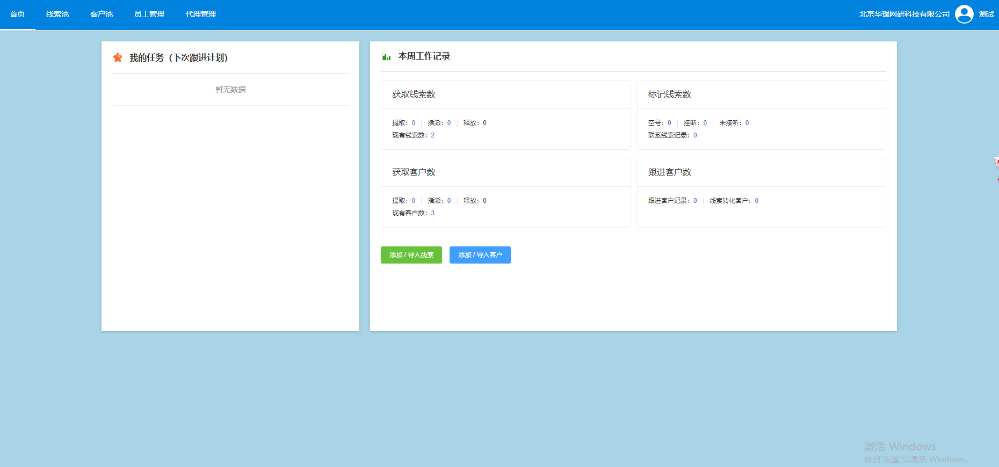

<a href="https://sales.rntd.cn/"></a>

## 体验地址
- 域名：https://sales.rntd.cn/
- 账号：测试
- 密码：123456


## 部署说明

# 前端部署

> A Vue.js project
- 需要的环境：node.js

## Build Setup
``` bash
# 进入前端目录
>> cd client-vue
# 安装依赖项
>> npm install

# 在本地以热重载方式启动服务 localhost:8080
>> npm run dev

# 打包部署
>> npm run build

# 打包部署同时查看打包详情
>> npm run build --report
```


# 服务端
